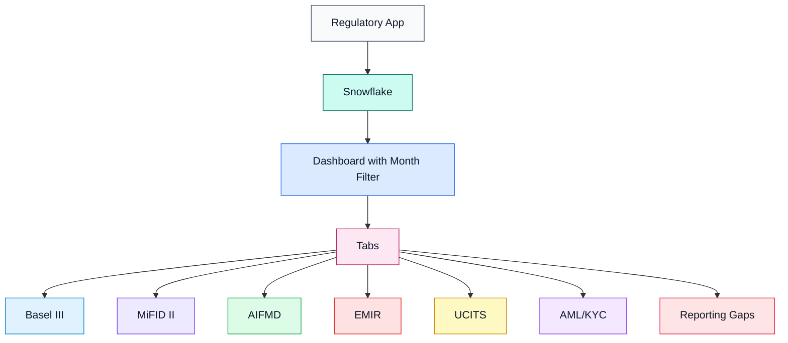
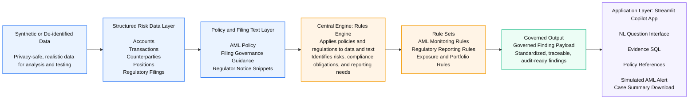
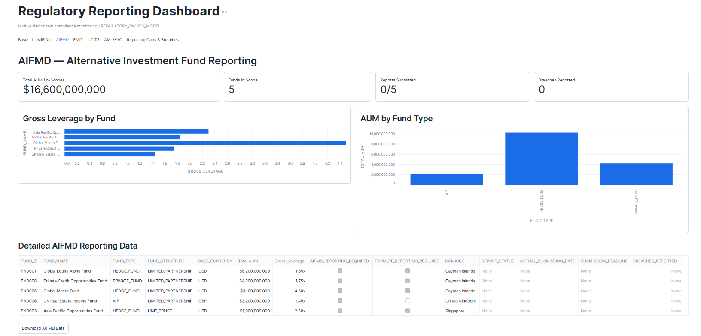
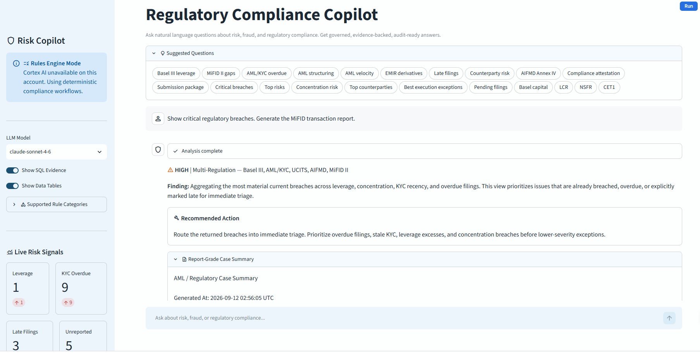

# Risk, Fraud and Regulatory Intelligence Platform Copilot & Dashboard

## Team **RRR**

This is the repo for the RRR Team on the GCC Snowflake CoCo Hackathon

## Team Members

| S. No. | Name |
|------------|------|
| 1 | Bhanu Prashanthi Murthy |
| 2 | Srikanth Bhaskar|
| 3 | Durga Prasana Kishore Meka |
| 4 | Ishant Kulshreshtha |


## 1. Business Problem

Banks and NBFCs generate large volumes of transaction, account, credit, and compliance data, but risk and regulatory investigations are still largely manual and fragmented.

Compliance teams often need to:

- monitor regulatory exposure
- identify reporting gaps
- investigate breaches
- review AML/KYC exceptions
- understand filing status
- investigate suspicious activity
- produce evidence for controls and audits
- prepare regulatory submissions

The **RRR team** developed a Snowflake-based solution featuring two key applications:
- **Risk & Fraud Copilot** — Enables users to investigate risk and fraud scenarios using natural-language questions and receive governed, explainable, and evidence-backed insights.
- **Regulatory Dashboard** — Provides an interactive view of regulatory compliance, reporting gaps, and regulatory reporting activities.

The solution leverages **Snowflake capabilities such as CoCo, Cortex (Cortex AI/Copilot), Streamlit, and Snowflake data storage** to bring financial data and regulatory knowledge together, delivering governed, explainable and evidence-backed insights.<br />

 **Snowflake CoCo helps us to accelerate the application delivery lifecycle from planning and development through execution enabling faster time to delivery.**

## 2. Solution Overview

Risk, Fraud & Regulatory Intelligence Platform Copilot & Dashboard is a Snowflake powered compliance intelligence solution designed for financial institutions.

### Application 1. Regulatory Reporting Dashboard :-

A Snowflake Streamlit based regulatory reporting dashboard for monitoring compliance, exposure, and reporting gaps across multiple financial regulations, including **Basel III, MiFID II, AIFMD, EMIR, UCITS, and AML/KYC.**

This dashboard provides a consolidated regulatory reporting and compliance-monitoring interface across major buy-side and capital markets regulations, helping teams identify exposure, reporting completeness, and control breaches in a monthly reporting cycle.

#### Overview

This application connects to Snowflake and presents month-based regulatory reporting views for investment funds, transactions, positions, counterparties, and client due diligence data. 
It is designed to support compliance teams, risk teams, and reporting operations with a single dashboard for cross-regime monitoring.

#### Key Capabilities

- Connects to Snowflake using Streamlit's connection API
- Loads reporting periods dynamically from a date dimension
- Caches query results for performance using `st.cache_data`
- Provides separate reporting tabs for:
  - Basel III
  - MiFID II
  - AIFMD
  - EMIR
  - UCITS
  - AML/KYC
  - Reporting Gaps and Breaches
- Supports CSV export for each reporting section
- Highlights missing reporting attributes, breaches, and regulatory gaps

#### Regulatory Coverage

| Regulation | Monitoring |
|---|---|
| Basel III | Exposure, VaR, leverage, concentration |
| MiFID II | Transaction reporting, execution quality |
| AIFMD | AUM, leverage, filings, deadlines |
| EMIR | Derivatives, counterparties, clearing |
| UCITS | Concentration, leverage, liquidity |
| AML/KYC | Risk ratings and review status |


#### Reporting Gaps and Breaches
Identifies transactions and positions that cannot be properly reported or that violate regime requirements. Gap categories include:

- missing jurisdiction mapping
- missing MIC
- missing ISIN
- unreported transactions
- best execution failures
- short sale model violations
- concentration breaches
- derivative counterparty gaps
- OTC clearing or CSA issues
- UCITS leverage or liquidity concerns

#### Architecture Diagram



### Application 2. Risk & Fraud Copilot

Risk Fraud Copilot utilizes raw regulatory data and provides the capability to ask regulatory questions in plain English and get governed, evidence-backed answers from enterprise data.

It is useful for cases like:

- identifying compliance breaches such as leverage, concentration, filing, or AML review issues
- helping analysts investigate suspicious activity without writing SQL manually
- generating regulator-facing support outputs like filing status, compliance attestation support, and case summaries
- giving management a quick view of top risks, overdue controls, and remediation actions
- making demo or hackathon workflows usable for business users who understand compliance questions but do not know the underlying schema

**It utilizes raw regulatory data and provides the capability to ask regulatory questions in plain English and get governed, evidence-backed answers from enterprise data.**

For example:

> Show critical regulatory breaches.
> Generate the MiFID transaction report.

The Copilot routes the question to a deterministic rule, executes the associated evidence query and returns a governed response.

### Governed Response

Each response can contain:

- Finding
- Severity
- Regulation
- Evidence SQL
- Policy context
- Remediation
- Audit note
- Alert payload
- Case summary


#### Few Sample Rules Mapped in Application for reference

| Question | Status | Rule Key / Mapping | Notes |
| --- | --- | --- | --- |
| Generate MiFID transaction report. | Supported | `mifid` | Returns MiFID II reporting exceptions and evidence SQL. |
| Generate AIFMD Annex IV report. | Supported | `aifmd` | Returns Annex IV reporting status and evidence SQL. |
| Explain breach X | Planned / Schema-only | `breach_explain` | Live matching is disabled until `FACT_COMPLIANCE_BREACH` exists and is populated. |
| What is our LCR? | Partial | `lcr` | New proxy metric only; formal LCR inputs are not modeled. |
| What is our NSFR? | Partial | `nsfr` | New proxy metric only; formal ASF/RSF components are not modeled. |
| Show controls breached today | Supported | `critical_breaches` | Approximated by current breach inventory, though not time-bucketed to intraday controls. |
| What are today's top risks? | Supported | `top_risks` | New summary rule returns top risk themes by issue volume. |


#### Architecture Diagram



## 3. How the Two Applications Work Together

The Dashboard and Copilot serve different user needs.

| Dashboard | Copilot |
|---|---|
| Visual monitoring | Natural-language investigation |
| KPIs and charts | Governed findings |
| Monthly reporting | Ad-hoc questions |
| Cross-regulation overview | Root-cause investigation |
| Reporting gaps | Evidence SQL |
| CSV exports | Case summaries |
| Management view | Analyst workflow |

### Example workflow

1. Compliance manager opens the Dashboard.
2. Dashboard identifies a concentration breach.
3. User asks the Copilot:
   "Which funds are causing the concentration breach?"
4. Copilot matches the question to the concentration rule.
5. Evidence SQL is generated/executed.
6. Finding and remediation are returned.
7. User can use the evidence for investigation or reporting.


## 4. Snowflake Data Source

The dashboard queries data from the Snowflake schema:

- `REGULATORY_DW.REG_MODEL`

It relies on fact and dimension tables such as:

- `FACT_POSITION`
- `FACT_TRANSACTION`
- `FACT_REGULATORY_REPORT`
- `DIM_DATE`
- `DIM_FUND`
- `DIM_SECURITY`
- `DIM_COUNTERPARTY`
- `DIM_GEOGRAPHY`
- `DIM_ACCOUNT`
- `DIM_TRADE_MODEL`
- `DIM_REGULATORY_JURISDICTION`


## 5. Project Structure

```text
gcc-sf-coco-rrr/
│
├── regulatory-dashboard/
│   ├── streamlit_app.py
│   └── ...
│
│
├── risk-fraud-copilot-v2/
│   ├── app.py
│   ├── rules_engine.py
│   └── ...
│
├── cortex/
│   └── ...
│
├── README.md
└── LICENSE
```


### Environment Requirements

Expected runtime dependencies include:

- Python
- Streamlit
- Snowflake connection configured through Streamlit
- Access to the `REGULATORY_DW.REG_MODEL` schema

#### Regulatory Reporting Dashboard
- The Dashboard Streamlit entry point in this repo is `streamlit_app.py`.
- Run streamlit_app.py file in snowflake.

##### Application Screenshots  


#### Risk Fraud Copilot V2 :- 
- The Copilot V2 Streamlit entry point in this repo is `app.py`.
- Run app.py file in snowflake.

##### Application Screenshots  




