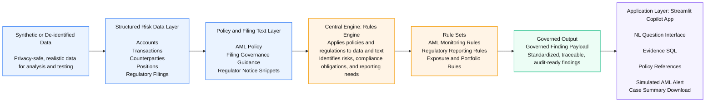

This is the repo for the RRR Team on the GCC Snowflake CoCo Hackathon
## Team

**RRR** — Snowflake CoCo CLI Hackathon

## Team Members

| Roll Number | Name |
|------------|------|
| 1 | Bhanu Prashanthi Murthy |
| 2 | Srikanth Bhaskar|
| 3 | Durga Prasana Kishore Meka |
| 4 | Ishant Kulshreshtha |

# Risk, Fraud and Regulatory Intelligence Copilot

## Regulatory Reporting Dashboard :-

A Streamlit-based regulatory reporting dashboard for monitoring compliance, exposure, and reporting gaps across multiple financial regulations, including Basel III, MiFID II, AIFMD, EMIR, UCITS, and AML/KYC.

This dashboard provides a consolidated regulatory reporting and compliance-monitoring interface across major buy-side and capital markets regulations, helping teams identify exposure, reporting completeness, and control breaches in a monthly reporting cycle.

### Overview

This application connects to Snowflake and presents month-based regulatory reporting views for investment funds, transactions, positions, counterparties, and client due diligence data. It is designed to support compliance teams, risk teams, and reporting operations with a single dashboard for cross-regime monitoring.

### Key Capabilities

- Connects to Snowflake using Streamlit's connection API
- Loads reporting periods dynamically from a date dimension
- Caches query results for performance using `st.cache_data`
- Provides separate reporting tabs for:
  - Basel III
  - MiFID II
  - AIFMD
  - EMIR
  - UCITS
  - AML/KYC
  - Reporting Gaps and Breaches
- Supports CSV export for each reporting section
- Highlights missing reporting attributes, breaches, and regulatory gaps

### Data Source

The dashboard queries data from the Snowflake schema:

- `REGULATORY_DW.REG_MODEL`

It relies on fact and dimension tables such as:

- `FACT_POSITION`
- `FACT_TRANSACTION`
- `FACT_REGULATORY_REPORT`
- `DIM_DATE`
- `DIM_FUND`
- `DIM_SECURITY`
- `DIM_COUNTERPARTY`
- `DIM_GEOGRAPHY`
- `DIM_ACCOUNT`
- `DIM_TRADE_MODEL`
- `DIM_REGULATORY_JURISDICTION`

### Functional Areas

#### Basel III
Summarizes fund-level risk and capital exposure metrics, including:

- total exposure
- VaR at 95% and 99%
- weighted leverage
- concentration breaches
- position counts

#### MiFID II
Tracks transaction reporting and execution quality metrics, including:

- total trades
- total notional
- best execution pass rates
- algo execution activity
- reporting completion
- missing venue MIC identifiers

#### AIFMD
Surfaces in-scope alternative fund reporting details, including:

- total AUM
- leverage
- reporting obligations
- domicile
- report submission status
- submission deadlines
- breaches reported

#### EMIR
Focuses on derivatives exposure and counterparty reporting, including:

- OTC derivatives
- central clearing eligibility
- CSA coverage
- exposure by counterparty
- collateral and margin requirements

#### UCITS
Monitors UCITS fund compliance, including:

- AUM
- leverage ratio
- concentration breaches
- max single-position concentration
- derivative exposure
- liquidity-related concerns

#### AML/KYC
Tracks client risk and due diligence status, including:

- AML risk ratings
- KYC review dates
- overdue and due-soon reviews
- domicile and regulatory zone
- client type and classification

#### Reporting Gaps and Breaches
Identifies transactions and positions that cannot be properly reported or that violate regime requirements. Gap categories include:

- missing jurisdiction mapping
- missing MIC
- missing ISIN
- unreported transactions
- best execution failures
- short sale model violations
- concentration breaches
- derivative counterparty gaps
- OTC clearing or CSA issues
- UCITS leverage or liquidity concerns

### User Flow

1. The user selects a reporting month from the sidebar.
2. The app derives the reporting period start and end dates.
3. Each tab queries Snowflake for that reporting slice.
4. Metrics, charts, and detail tables are rendered.
5. Users can export tab-specific datasets as CSV files.

### Technical Notes

- The app uses `st.connection("snowflake")` for database access.
- All query loaders are memoized with `st.cache_data`.
- A manual refresh button clears all cached query results.
- The UI is organized with tabs, metrics, charts, and data tables.
- The app assumes Snowflake data quality and schema consistency for regulatory analytics.

## Intended Audience

This dashboard is suitable for:

- compliance analysts
- regulatory reporting teams
- fund operations teams
- risk managers
- internal audit or control functions

### Environment Requirements

Expected runtime dependencies include:

- Python
- Streamlit
- Snowflake connection configured through Streamlit
- Access to the `REGULATORY_DW.REG_MODEL` schema

## Risk Fraud Copilot V2 :- 

Risk Fraud Copilot utilizes raw regulatory data and provides the capability to ask regulatory questions in plain English and get governed, evidence-backed answers from enterprise data.

It is useful for cases like:

- identifying compliance breaches such as leverage, concentration, filing, or AML review issues
- helping analysts investigate suspicious activity without writing SQL manually
- generating regulator-facing support outputs like filing status, compliance attestation support, and case summaries
- giving management a quick view of top risks, overdue controls, and remediation actions
- making demo or hackathon workflows usable for business users who understand compliance questions but do not know the underlying schema

### App Flow

If you create or use an `app.py` entry point, the expected integration is:

1. Read a user question from the UI or CLI.
2. Pass that question into `match_rule_based()` from `rules_engine.py`.
3. Render the returned finding, severity, regulation, evidence SQL, remediation, and audit note.
4. Optionally render policy context with `get_policy_context()`.
5. For AML matches, optionally build alert output with `build_alert_payload()` and case-summary output with `build_case_summary()`.

### Key Files
- `app.py`: Its application layer and have the code for Streamlit copilot chat UI which accepts the user’s question and renders the output back to the screen.
- `rules_engine.py`: is the decision and response layer. It contains the rule library, question matchers, policy references, SQL evidence queries, and helper functions that build structured responses. Its job is to take a plain-language question and return a governed response with fields like finding, severity, regulation, SQL, remediation, and audit note.

### Run Notes

- Python version: 3.11+
- Declared dependencies are in `pyproject.toml`.
- The project description indicates a Streamlit-based demo app, but no `app.py` file currently exists in this workspace.
- If you want a runnable UI entry point, create `app.py` or `streamlit_app.py` and wire it to `rules_engine.py` using the pattern above.
- The Copilot V2 Streamlit entry point in this repo is `app.py`.
- Run app.py file in snowflake.

### Architecture Flow
1. Synthetic / de-identified data generation
2. Structured data layer
Account, transaction, counterparty, position, filing, and jurisdiction datasets
3. Policy and filing text layer
AML policy excerpts, filing governance guidance, regulator notice snippets
4. Rules and reasoning layer
Deterministic rules engine for  Basel, MiFID, EMIR, UCITS, filings, and counterparty controls
5. Copilot application layer
Streamlit UI for natural-language questions, governed findings, evidence, and downloads
6. Output layer
Evidence SQL, alert payload, case summary report, audit note

### End-to-End Workflow
- Ingest or generate synthetic data
- Transform into governed compliance entities
- Ask a natural-language question
- Match question to risk/compliance scenario
- Execute evidence query
- Attach policy context
- Produce finding, alert, and report artifact

### Guardrails
- Deterministic control routing in rules mode
- Evidence-backed outputs only
- Structured response contract
- Clear audit note and remediation
- Utilize rule_engine when LLM not available

### Sample Rules Matrix for refernce

This matrix maps the requested business questions to the current deterministic rules in the app.

| Question | Status | Rule Key / Mapping | Notes |
| --- | --- | --- | --- |
| Generate MiFID transaction report. | Supported | `mifid` | Returns MiFID II reporting exceptions and evidence SQL. |
| Generate AIFMD Annex IV report. | Supported | `aifmd` | Returns Annex IV reporting status and evidence SQL. |
| Generate Basel III capital report. | Partial | `basel_capital` | New proxy report; not a formal capital return because CET1 and RWA facts are not modeled. |
| Create compliance attestation. | Supported | `compliance_attestation` | Returns attestation support data and evidence SQL. |
| Prepare regulator submission package. | Supported | `submission_package` | Returns submission support package data and evidence SQL. |
| Show all regulatory breaches | Partial | `critical_breaches` | New high-priority breach inventory, but not a complete enterprise breach register. |
| Show critical breaches | Supported | `critical_breaches` | Returns the material breaches currently modeled. |
| Explain breach X | Planned / Schema-only | `breach_explain` | Live matching is disabled until `FACT_COMPLIANCE_BREACH` exists and is populated. |
| Show evidence for breach X | Planned / Schema-only | `breach_evidence` | Live matching is disabled until `FACT_COMPLIANCE_BREACH` exists and is populated. |
| Which funds exceed leverage limits? | Supported | `leverage` | Direct leverage breach query exists. |
| Which exposures exceed limits? | Supported | `concentration` | Uses concentration breach logic. |
| What is our LCR? | Partial | `lcr` | New proxy metric only; formal LCR inputs are not modeled. |
| What is our NSFR? | Partial | `nsfr` | New proxy metric only; formal ASF/RSF components are not modeled. |
| What is our CET1 ratio? | Partial | `cet1` | New proxy metric only; explicit CET1 and RWA tables are not modeled. |
| Show concentration risk | Supported | `concentration` | Direct concentration breach query exists. |
| Show top counterparties | Supported | `counterparty` | Returns largest counterparty exposures. |
| Show suspicious transactions | Partial | `aml_structuring` | Mapped to one suspicious-pattern rule, not a complete suspicious activity inventory. |
| Show AML alerts | Planned / Schema-only | `aml_alerts` | Live matching stays gated until `FACT_AML_ALERT` is created and manually refreshed from the AML rule scenarios. |
| Show unusual trading activity | Partial | `aml_velocity` | Mapped to burst activity logic, not a full market-abuse or surveillance layer. |
| Show best execution exceptions | Supported | `mifid` | Covered by MiFID compliance gap logic. |
| Show client suitability exceptions | Planned / Schema-only | `suitability_exceptions` | Live matching is disabled until `DIM_CLIENT_SUITABILITY_ASSESSMENT` exists and is populated. |
| Generate MiFID report | Supported | `mifid` | Same as MiFID transaction reporting check. |
| Generate AIFMD report | Supported | `aifmd` | Same as Annex IV status check. |
| Generate Basel III report | Partial | `basel_capital` | Supported through a capital proxy, not a full Basel reporting pack. |
| Show pending regulatory filings | Supported | `filing` | Filing status and overdue/late logic already exists. |
| Show audit trail for transaction X | Planned / Schema-only | `transaction_audit_trail` | Live matching is disabled until `FACT_TRANSACTION_AUDIT_TRAIL` exists and is populated. |
| Show controls breached today | Supported | `critical_breaches` | Approximated by current breach inventory, though not time-bucketed to intraday controls. |
| What are today's top risks? | Supported | `top_risks` | New summary rule returns top risk themes by issue volume. |
| Summarize compliance posture | Supported | `top_risks` | Returns a management summary across major issue classes. |
| What actions are recommended? | Supported | `top_risks` | Each matched rule returns remediation; top risks now also carries summary remediation. |

### Architecture Diagram

